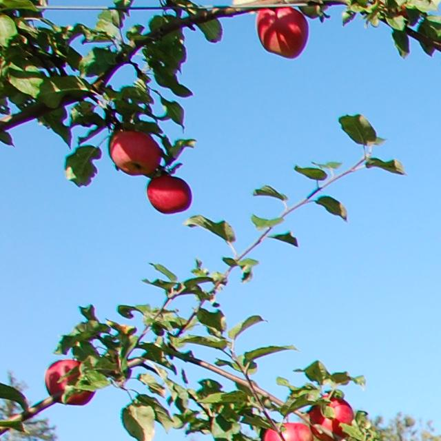
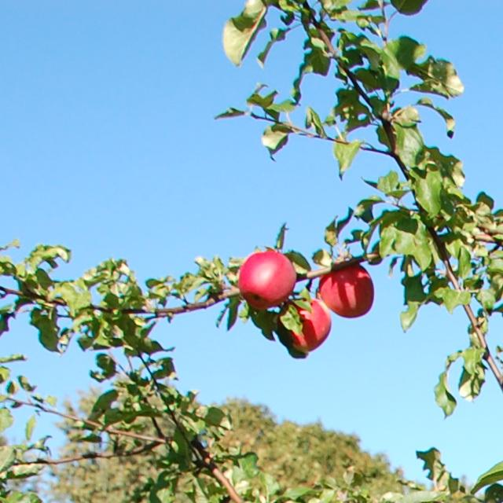
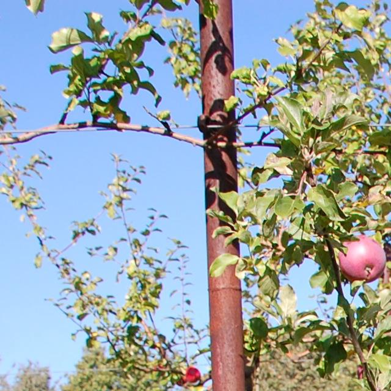

# AppleBBCH81

[](#citation) 
[](https://creativecommons.org/licenses/by/4.0/) 
[](#changelog)

The photo fixation of apple fruits was done in the LatHort orchard in Dobele, at the maturity of fruit and seed (BBCH stage 81-85). BBCH-scale describes the phenological development of grapes: 8 - maturity of fruit and seed; 81 - beginning of ripening; 85 - advanced ripening. Two photo images were taken for each tree – perpendicularly, in a tree-facing view and in an oblique view. The images were annotated using the tool makesense.ai. Then the annotated images 3008x2000 were automatically cropped out on 640x640 images with overlap 30% and validated manually. The images were saved in YOLO format.

- Project page: `https://www.kaggle.com/datasets/projectlzp201910094/applebbch81` 
- Issue tracker: use this repo

## TL;DR
- Task: detection
- Modality: RGB 
- Platform: ground 
- Real/Synthetic: real
- Images: ~1,838 
- Classes: 1 
- Resolution: various
- Annotations: YOLO (.txt) and COCO JSON
- License: CC BY 4.0 (see License)
- Citation: see below

## What's inside
- [Download](#download)
- [Dataset structure](#dataset-structure)
- [Sample images](#sample-images)
- [Annotation schema](#annotation-schema)
- [Stats and splits](#stats-and-splits)
- [Quick start](#quick-start)
- [Evaluation and baselines](#evaluation-and-baselines)
- [Datasheet (data card)](#datasheet-data-card)
- [Known issues and caveats](#known-issues-and-caveats)
- [License](#license)
- [Citation](#citation)
- [Changelog](#changelog)
- [Contact](#contact)

## Download
- Train/val/test images: see Kaggle page (md5: `pending`)
- Annotations (COCO): produced with `scripts/convert_to_coco.py` into `annotations/` (md5: `pending`)
- Labels (YOLO): `data/labels/`

## Dataset structure
```
datasets/AppleBBCH81/
├── data/
│   ├── images/               # images (*.jpg)
│   └── labels/               # YOLO labels (*.txt)
├── annotations/              # COCO JSON exports
├── scripts/                  # utilities
│   ├── convert_to_coco.py
│   └── generate_splits.py
├── sets/                     # split lists (train/val/test)
└── README.md
```
- Splits: `sets/train.txt`, `sets/val.txt`, `sets/test.txt`, `sets/all.txt`

## Sample images
<table>
  <tr>
    <th>Sample</th>
    <th>Image</th>
  </tr>
  <tr>
    <td><strong>Example 1</strong></td>
    <td>
      
      <div align="center"><code>data/images/DSC_1042_17kv1r16k_0.jpg</code></div>
    </td>
  </tr>
  <tr>
    <td><strong>Example 2</strong></td>
    <td>
      
      <div align="center"><code>data/images/DSC_1043_17kv1r17k_1.jpg</code></div>
    </td>
  </tr>
  <tr>
    <td><strong>Example 3</strong></td>
    <td>
      
      <div align="center"><code>data/images/DSC_1071_17kv2r20k_0.jpg</code></div>
    </td>
  </tr>
  <!-- More samples exist in the dataset -->
  </table>

## Annotation schema
- COCO-style (example):
```json
{
  "info": {"year": 2024, "version": "1.0.0", "description": "AppleBBCH81", "url": "https://www.kaggle.com/datasets/projectlzp201910094/applebbch81", "date_created": "2024-04-12"},
  "images": [{"id": 1, "file_name": "xxx.jpg", "width": 640, "height": 640}],
  "categories": [{"id": 1, "name": "apple", "supercategory": "fruit"}],
  "annotations": [{"id": 10, "image_id": 1, "category_id": 1, "bbox": [x,y,w,h], "area": 1234, "iscrowd": 0}]
}
```
- YOLO-style (per-image `.txt`): `<class_id> <x_center> <y_center> <width> <height>` (normalized 0–1)

## Stats and splits
- Counts: images per split and instances per class (1 class: `apple`)
- Use `scripts/generate_splits.py` to create `train/val/test` lists

## Quick start
Python (COCO):
```python
from pycocotools.coco import COCO
coco = COCO("annotations/applebbch81_instances_train.json")
img_ids = coco.getImgIds()
img = coco.loadImgs(img_ids[0])[0]
ann_ids = coco.getAnnIds(imgIds=img['id'])
anns = coco.loadAnns(ann_ids)
```

## Evaluation and baselines
- Metric: mAP@[.50:.95] (COCO), IoU for bbox overlap

| Method | Backbone | Metric(s) | Link |
|---|---|---|---|
| – | – | – | – |

## Datasheet (data card)
- Motivation: apple detection in orchard scenes (BBCH stage 81)
- Composition: ~1,838 images, 1 class (`apple`)
- Collection process: field images
- Preprocessing: none required; labels in YOLO, COCO produced by script
- Distribution: open; see License
- Maintenance: community-maintained

## Known issues and caveats
- Original labels are YOLO; COCO JSON is derived via script.

## License
- CC BY 4.0. See `LICENSE` in this folder.

## Citation
```bibtex
@misc{applebbch81,
  title={AppleBBCH81},
  year={2024},
  note={Dataset},
  url={https://www.kaggle.com/datasets/projectlzp201910094/applebbch81}
}
```

## Changelog
- V1.0.0: initial standardized layout and COCO converter (2025-08-12)

## Contact
- Maintainer(s): community 
- Issues: this repo


